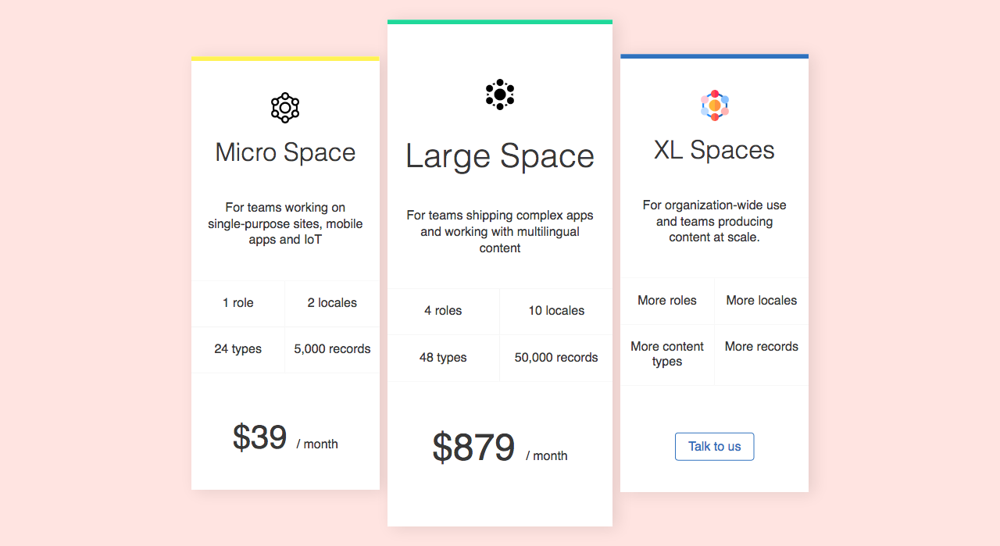

# Price cards

Create 3 cards next to each other, the middle one is larger than the other 2. All 3 cards are vertically centered. The 1st and 3rd cards may or may not have the same height.

There are few ways you can achieve this.

    
Hint

    * transform
    * flex-grow and flex-shrink, and manually increasing the spaces and sizes

On hover the cards move a bit up, have a look at the video in this folder.

Extra: make it responsive, maybe cards should stack one below the other.

> Note: You could use tables for some part of this exercise but you dont have to.

> Note: In the `images` folder you can find the icons used in the example, but feel free to use others.
# price-card
